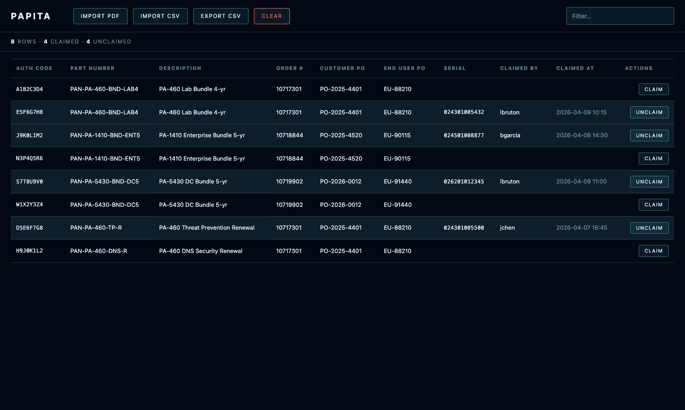
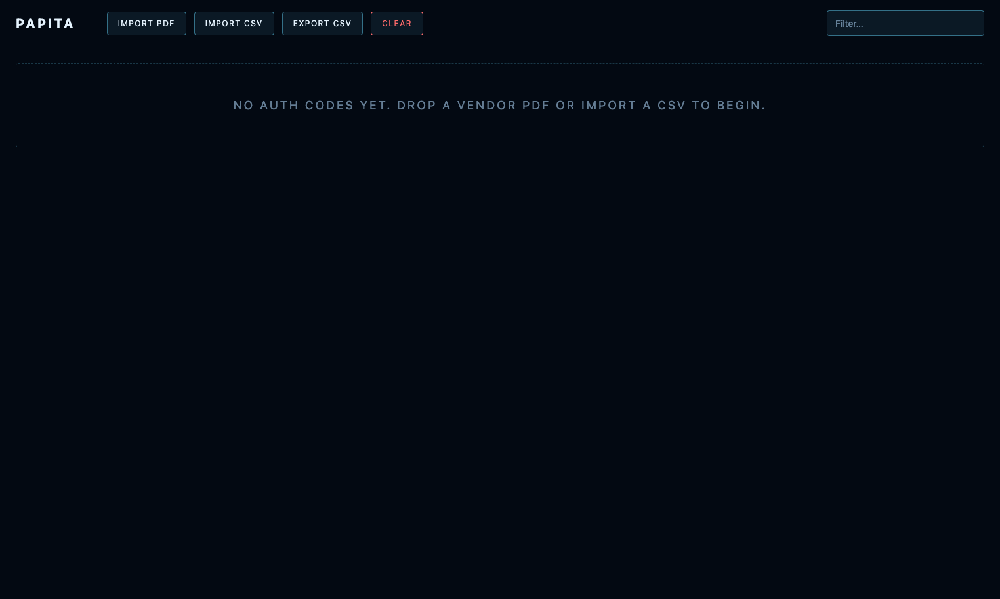
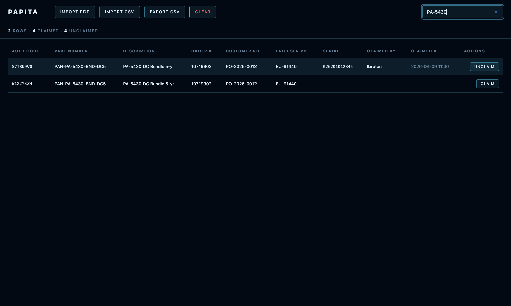

# PAPiTA — Palo Alto Inventory Tracking Assistant

A lightweight, browser-only tool for reconciling Palo Alto Networks firewall auth-code and inventory data. Ingests vendor PDFs and CSVs, normalizes records into a single table, lets you claim serials against auth codes, and exports the results — all without a backend, an account, or a network round-trip.



## Features

- **PDF Import** — drag-and-drop or click to import Palo Alto vendor auth-code PDFs
- **CSV Import/Export** — round-trip data via RFC 4180 CSV with injection guards
- **Claim Tracking** — assign serial numbers to auth codes during rack-and-stack
- **Filter** — real-time search across all columns
- **Offline** — works with zero network access after first load; all dependencies vendored
- **Data stays local** — everything lives in your browser's localStorage, nothing leaves your machine

## Screenshots

| Empty State | Filtered View |
|---|---|
|  |  |

## Quick Start

### Option 1: Static File Server

Serve the directory with any static file server:

```bash
python3 -m http.server 8765
```

Then open [http://localhost:8765/](http://localhost:8765/).

### Option 2: Docker

```bash
docker compose up -d
```

The app will be available at [http://localhost:8765/](http://localhost:8765/).

To build and run manually:

```bash
docker build -t papita .
docker run -d -p 8765:8080 --name papita papita
```

The container uses **nginx:alpine** (~25 MB), runs as a non-root user, and is compatible with OpenShift and Podman.

### Option 3: GitLab / GitHub Pages

Deploy the repository contents as-is — no build step required. Point your Pages configuration at the root directory.

## Architecture

| Module | Purpose |
|--------|---------|
| `js/store.js` | Single source of truth + localStorage persistence |
| `js/parser.js` | pdf.js text-layer extraction |
| `js/csv.js` | RFC 4180 codec with CSV-injection guard |
| `js/render.js` | Table render loop, sort, filter, event delegation |
| `js/claim.js` | Claim/unclaim flow + duplicate-serial modal |
| `js/app.js` | Entry wiring (no business logic) |
| `js/utils/` | Shared helpers (escaping, time, DOM) |
| `vendor/pdfjs/` | Pinned pdf.js v4.10.38 legacy ESM build |

Vanilla HTML, CSS, and ES modules — no frameworks, no bundlers, one vendored dependency.

## Vendored Dependencies

| Library | Version | Source |
|---------|---------|--------|
| pdf.js  | v4.10.38 | [mozilla/pdf.js](https://github.com/mozilla/pdf.js/releases) |

## Data Privacy

Vendor PDFs and exported CSVs contain **sensitive customer and licensing data**. Treat them accordingly:

- **Never** commit vendor PDFs or exported CSVs to this repository
- The `.gitignore` excludes `*.pdf`, `*.csv`, and the `CoWork/` scratch directory
- All data stays in your browser's `localStorage` — nothing is transmitted anywhere

## Sample Data

The `samples/` directory contains mock PDF fixtures with synthetic data for testing. These contain no real customer information.

## License

Internal use only.
